---
title: "MAAS - Datacenter"
author: [Marc Sànchez Pifarré, GEINF (UDG-EPS)]
date: 4 de Desembre de 2019
subject: "Udg - Eps"
tags: [MAAS]
subtitle: "Tutor de la pràctica : Antonio Bueno"
titlepage: true
titlepage-color: 4a148c
titlepage-text-color: FFFFFF
titlepage-rule-height: 4
...

\newpage

# MAAS (Metal as a service)

## Context

Una empresa ISP de girona (l'anomenarem Fibrix) vol entrar al mercat de l'emmagatzemament web i facilitar als seus clients la possibilitat de poder allotjar-hi les seves pròpies màquines virtuals. De fet aquesta empresa té l'objectiu d'unificar el domini d'una connexió bona de dades, no només venen el servei de connexió sinó també afegint els serveis de datacenter, concretament la possibilitat que una altre empresa tecnològica del sector pugui contractar amb el mateix ISP un servei de cloud. 

Fibrix ha aconseguit accés a un seguit de màquines físiques provinents de una altre empresa cloud del sector. Aquesta altre empresa ha de mantenir un volum molt gran de feina i ha decidit invertir en Fibrix regalant-li un hardware usat i una mica anticuat. 

El hardware regalat és un hardware limitat en capacitats. Concretament ha rebut servidors [DELL POWEREDGE 860](https://www.dell.com/downloads/emea/products/pedge/es/pe860_spec_sheet.pdf) [1]. 

Els servidors que ha aconseguit Fibrix son servidors professionals, de marca propietària i cara peró en quan a tecnologia es podrien anomenar vellots. Tenen la possibilitat de tenir 1 processador XEON doble nucli (dual core) amb freqüència de gir màxima de 2.66GHz i memòria RAMM de fins a un màxim de 8Gb. 

Però se n'adonen que aquests servidors tenen quelcom molt bo, Compatibilitat estàndard de [BMC](https://docs.bmc.com/docs/bcm120/introducing-remote-management-570589616.html) [2] amb [IPMI](https://en.wikipedia.org/wiki/Intelligent_Platform_Management_Interface) [3] 1.5. Que ve a ser, gestió i control remot de la màquina sense necessitat de sistema operatiu. 

# Possibilitats en funció del hardware. 

**Opció 1**

La primera possibilitat, també la més vanal, seria pensar en muntar una màquina física per cada client. Peró....

- De seguida ens quedariem sense màquines. 
- Capacitat d'ampliació limitada per client.
- El cost de la inversió en noves màquines s'hauria de reperectir als clients.

Mal negoci.

**Opció 2**

Dockerització (IAAS - Infraestructure as a service). Muntar una sèrie de servidors docker i que cada client pugui desplegar les seves aplicacions web, ja siguin html/css o qualsevol altre llenguatge i tecnologia mitjançant una interfície web d'administració. 

Aventatges :

- Docker permet crear instàncies virtuals sobre màquines físiques. 
- Docker permet crear xarxes internes i overlays entre altres dockers. 
- Docker ocupa només el que s'ha desplegat i és escalable. 
- Molts...

Docker éns aportaria escalabilitat i fins i tot ens podriem plantejar la alta disponibilitat realitzant bé la feina. 

Inconvenients : 

Docker està pensat per què els seus nuclis de treball suportin càrregues suficients com per mantenir l'estructura de les aplicacions + les rèpliques dels demés. En el nostre cas les màquines no son gaire grosses i per tant el marge d'escalabilitat és estret i no seria possible implementar una bona qualitat de servei. 

Tanmateix el producte que es vol vendre als clients son màquines senceres, poden ser windows Server, Ubuntu, CentOs. **Docker no està pensat per suportar la integració de Sistemes operatius complerts, està pensat per ser instal·lat sobre un kernel i emular-lo**.

**Opció 3**

El muntatge d'un cluster, capaç de tenir la flexibilitat d'afegir i treure màquienes físiques per poder-lo fer escalable. Ens ha de permetre la creació de màquines virtuals mitjançant imatges i el desplegament de les mateixes. Tanmateix ens ha de subministrar eines per a la comprovació de l'estat del hardware de les màquines físiques. 

Aquí entra [MAAS](https://maas.io) [4].

Una plataforma per crear datacenters basada en virtualització i feta exclusivament pensant en grans infraestructures que volen tenir la possibilitat d'escalar. La clau de l'èxit és la manera que té maas d'aprofitar la màquina física utiltizant BMC i IPMI. les màquines no requereixen de sistema operatiu i posen a disposició del hardware tots els recursos dels que disposen. 

L'empresa Fibrix decideix que aquesta és la solució més viable al seu objectiu.

# Com funciona MAAS? 

Maas defineix uns conceptes importants per funcionar. 

- Region.
- Controller.
- Fabric.
- Pool. 

L'esquema seria quelcom similar a: 

{ width=350px }

**Region**

Una regió és definida com un espai físic on s'hi situen un seguit de màquines, una empresa TIER 3, per aconseguir tenir el TIER 3 està obligat a tenir rèpliques de les màquines a 3 regions diferents. És part de la alta disponibilitat. 

L'empresa Fibrix, degut a què és una start up i que encara no ha pogut desenvolupar el sistema està definida directament com una regió on hi podrà haver 1 o més controladors. 

El servidor de regió ha de ser el que gestiona les peticions d'operació. És a dir, ha de ser capaç de gestionar el DNS per tot el que es consideri regi, en definitiva és el punt de gestió del datacenter. 

**Controller**

Els controladors son els racks on hi poden haver diferents màquines físiques. Proveeix serveis d'alta capacitat de xarxa a tots els servidors del rack. En essència cobreix les necessitat que hi pugui haver en un rack de servidors físic dins d'un datacenter. 

Se n'ocupa de serveis com per exemple : 

- El wake on lan de les seves màquines. 
- L'arrencada per PXE. 
- Gestiona els serveis BMC amb IPMI o Virish. 
- Gestiona la virtualització entre les diferents màquines. 
- Se n'encarrega del dhcp de la xarxa i manté la subxarxa. 

En general cada rack controller ha de tenir la seva subxarxa, ja sigui mitjançant el pas d'una NAT o sense. 

**Fabric** 

Totes les màquines físiques dels rack controllers es poden agrupar per generar el que s'anomenen Fabric. Cada Fabric consta de una sèrie de màquines físiques que per simplicitat direm que es troben al mateix rack, peró en general son les que estan dins d'una VLAN. 

En aquesta capa encara estem treballant amb màquines físiques i el concepte de virtualització encara no ha aparegut. 

**Pool**

Aquí apareix el concepte de virtualització, i és que, totes les màquines físiques que gestiona maas acaben component el que s'anomena una piscina de recursos. Dins d'aquesta piscina és on es poden generar màquines virtuals. 

# Hardware

Com a hardware tenim un seguit de servidors DELL POWEREDGE 860 amb un dual Core i Majoritàriament 4Gb de RAMM. 

El hardware del que disposem està preparat per treballar en mode cluster, definirem el mode cluster com els pc's que disposen de : 

- WAKE ON LAN 
- BMC Support
- Boot per PXE
- Virtualization support

## Utilització del hardware

MAAS necessita els fabric's, és a dir, les màquines físiques, únicament com a màquines que presten el seu hardware. No cal que tinguin cap sistema operatiu. Per fer-ho, primer de tot utiltiza el wake on lan per encentre-les. Un cop s'han encés, s'ha de configurar el BMC ( Baseboard Management Controllers) [6] de la màquina, en aquest cas el sistema de Baseboard Management Controllers és IPMI versió 1.5, aixó ho estipula el fabricant. BMC es configura per aconseguir una ip en xarxa, per tant s'ha de permetre que la màquina arrenqui des de PXE des de la BIOS. Curiosament aquests servidors estan programats per què si hi ha hardware que està habilitat peró que no està posat (un disc sense endollar per actiu a la bios), que directament no arrequi. 

## Configuració prèvia del hardware

A l'hora d'afegir màquines al hardware s'han de prendre diferents mesures per poder garantir que el node controller té control total sobre elles. Per tant s'han de realitzar els següents passos. 

Configurar l'arrencada en xarxa des de la bios, MAAS ha de poder apagar i encendre les màquines quan ho requereixi per poder tenir un escalat més flexible. 

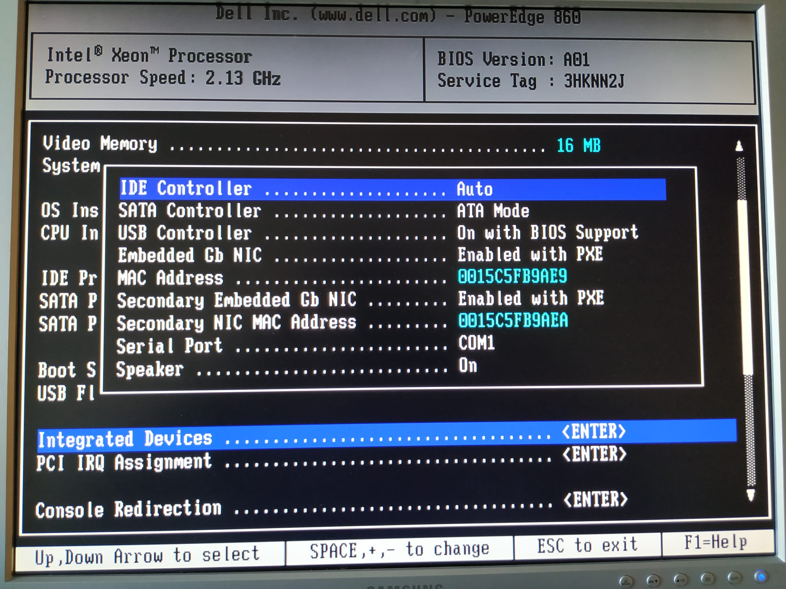{ width=350px }

Configurar el Wake on lan mitjançant Ctr + S, per poder arrencar-les mitjançant la interfície de xarxa es fa servir el protocol : 

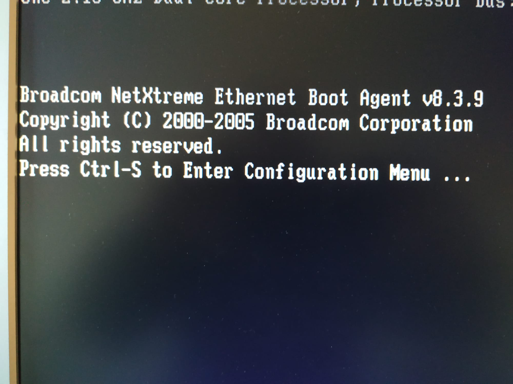{ width=350px }

Activant-lo n'hi ha prou. 

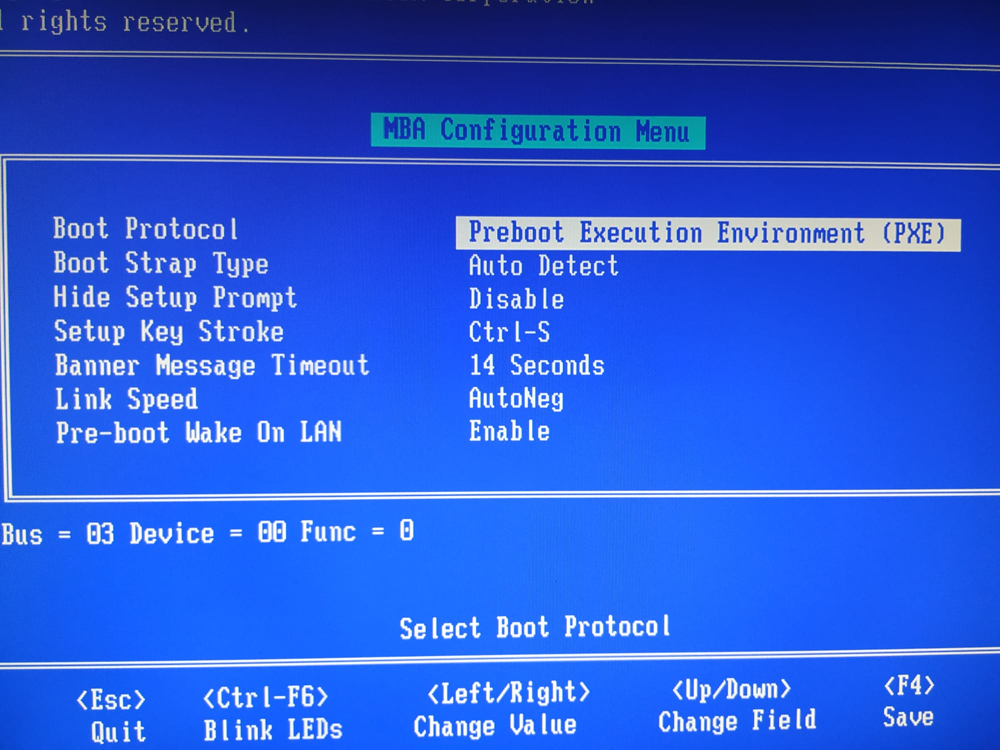{ width=350px }

Finalment s'ha de configurar el BMC (IPMI) accedint al seu panell amb Ctr + E. Volem que MAAS (el region controller) utilitzi les altres màquines únicament com a recursos hardware, sense fixar-nos en el sistema operatiu que porten. Degut a que les màquines ho permeten utilitzem IPMI peró es podrien configurar mitjançant VIRISH [7], un sistema de cluster sobre virtualització. Aquest sistema sí que requereix que hi hagi un sistema operatiu a les màquines worker amb el sistema de virtualització QEMU [7] instal·lat.  

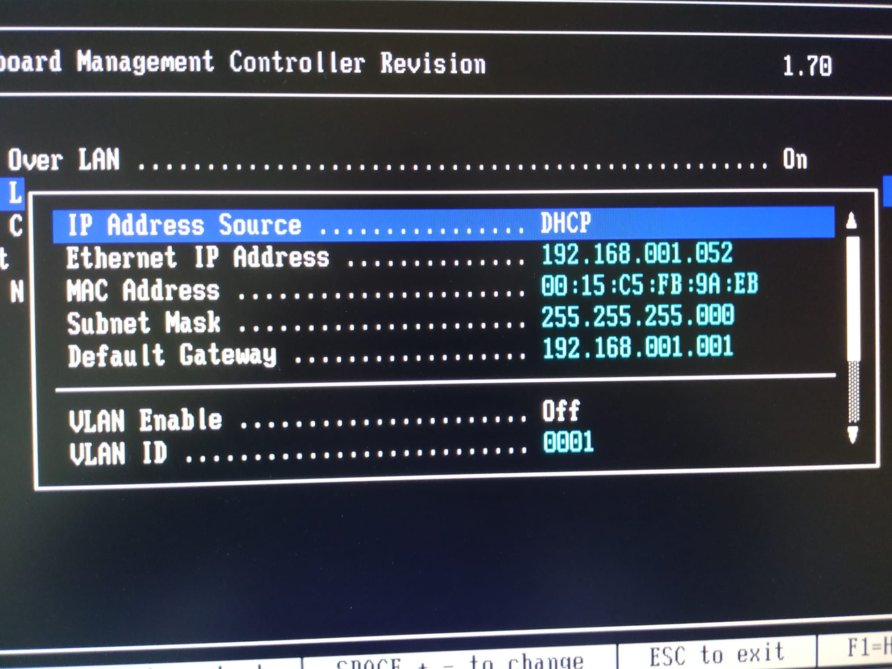{ width=350px }

# Connectivitat 

El sistema a plantejar és la màquina Rack / Region controller, que té dues interfícies de xarxa, estigui connectada amb la interfície 1 a internet (amb IP pública). El controlador de regió conté el DNS local per poder resoldre les màquines físiques i virtuals de la mateixa regió mentre que el controlador de rack conté el DCHP per poder assignar ip's a les màquines que el componen. 

Per tant des de l'exterior, cap a la xarxa del datacenter podem afirmar que hi ha un NAT. Internament, MAAS gestiona les IP's sense problemes generant subxarxes per cada Rack Controller. Aquestes subxarxes son configurables des de la interfície gràfica. 

En el nostre cas, utiltizem el rang d'adreces que conté la xarxa 192.168.1.0/24. 

La connectivititat entre el node rack i la resta de workers és mitjançant un switch ethernet. 

# Instal·lació de MAAS 

Instal·lar Maas es pot fer directament des del paquets apt. La idea no és fer un tutorial de instal·lació sinó veure quins son els diferents problemes que apareixen a l'hora d'intentar muntar un datacenter. 

Afegim el repositori 

```
sudo apt-add-repository -yu ppa:maas/stable
```

i Instal·lem.

```
sudo apt update
sudo apt install maas
```

En el nostre cas, per simplicitat, muntarem tant el Region com el Rack en una sola màquina. De fet és com aconsellen que es faci si no requereixes duplicar la infraestructura en diferents llocs geogràfics diferents. Si es requerís es podria muntar un Region controller en una màquina física i un Rack controller en una altre màquina física. 

Més informació a [5]. 

## Primera configuració

El primer que s'ha de fer un cop s'ha instal·lat MAAS és la inicialització. En el nostre cas li he de dir que volem que es comporti tant de region com de rack controller, aixó passa per fer-ho amb la següent instrucció. 

```
sudo maas init -mode all
```

Finalment, abans d'entrar a la interfície gràfica d'administració, hem de crear l'usuari root que hi tingui accés. 

```
sudo maas createadmin --username=$PROFILE --email=$EMAIL_ADDRESS
```

on : 

- $PROFILE : És el nom d'usuari
- $EMAIL_ADDRESS : és el correu electrònic de l'usuari. 

Podem inicialitzar el password mitjançant aquesta mateixa instrucció passant-li --password=$PASSWORD, o podem directament fer que el demani sense posar-lo. 

## Accés

MAAS dóna accés a la configuració mitjançant la url http://${API_HOST}:5240/MAAS on API_HOST és l'adreça de la màquina. Un cop en aquesta url iniciem sessió amb l'usuari i el password que s'han inicialitzat anteriorment. 

# Muntar el cluster mitjançant UI

MAAS realitza una exploració de les màquines que pugui haver-hi a les xarxes en les que ell pertany, té les interfícies en mode promiscu per poder detectar màquines noves i per poder resoldre-les. De fet a la finestra de network discovery apareixen aquestes màquines. 

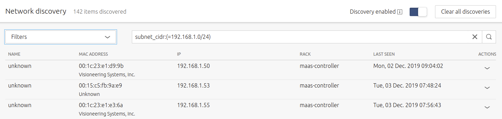{ width=350px }

S'han configurat 3 màquines utiltizant la descripció dels passos de hardware que s'han comentat anteriorment. 

Hem realitzat un filtre per què no surtin totes les de la xarxa externa (totes les màquines de la xarxa 84.88.154.0/23). Si despleguem una d'aquestes màquines mitjançant la fletxa descendent podem veure la seva adreça mac, que necessitarem per afegir-les al cluster com a machines.

De moment no en tenim cap. 

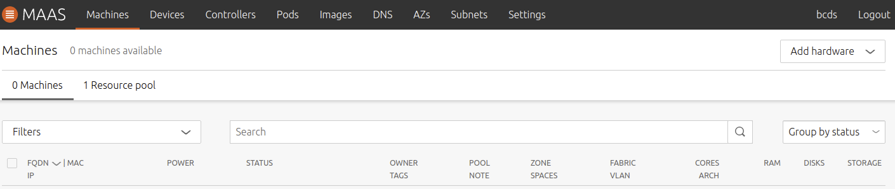{ width=350px }

Al botó add hardware de la part superior dreta de la pantalla, si el despleguem podem afegir una machine, la diferència entre machine i chassis es pot trobar a [8], Add Nodes.  Afegim un node : 

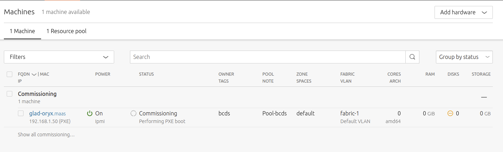{ width=350px }

I tot seguit ens salta a la finestra machines i ens mostra l'estat en el que es troba aquesta màquina. En aquest moment està en estat Commissioning. És a dir està comprovant els recursos de què disposa aquesta màquina worker, tot seguit quan acabi el commission, passarà els testos de hardware, principalment comprova ramm i disc. 

Veiem el llistat de coses que revisa... 

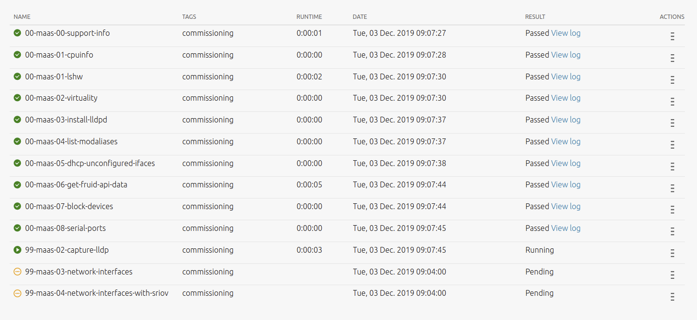{ width=350px }

Un cop s'ha enllaçat la màquina, ha passat els testos i el commission llavors passa a l'estat de Ready. A partir d'aquí afegirem més màquines al cluster. Utilitzem aquest punt com un checkpoint on a partir d'ara pot ser que les màquines canviin. 

L'estat actual en el que es deixen les màquines és el següent : 

# Virtualització - Creació i gestió de Pods.

Un cop maas coneix les màquines, té accés a elles i pot manegar-les per arrencar-les o fer un deploy (poasr-hi un ubuntu per exemple), hi ha dos tipus de tractar la virtualització de les màquines peró totes passen per la creació del que s'anomena un POD. Un Pod és un servidor virtual que permet crear màquines a dins. Existeixen dues tecnologies implementades des de MAAS que permeten crear pods. 

- Virsh
- RSD (Rack Scale Design)

## Rack Scale Design 

En definitiva Rack Scale Design és una tecnologia d'intel que permet la disgregació de hardware dins d'un cluster, generant nodes que tinguin un únic propòsit. Per exemple es poden destinar nodes al manteniment de la xarxa, nodes que s'utilitzin només en termes de computació i memòria i nodes que s'utiltizin només per emmagatzematge. 

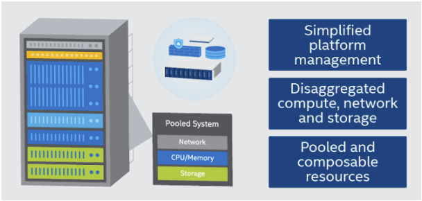{ width=350px }

Rack Scale design ha estat alliberat per Intel actualment està en versió OpenSource. Podeu trobar l'artícle que ho explica a la referència [9]. Rack Scale design estandaritza l'ús de la tecnologia intel per a la pura utilització del hardware. S'utilitza el protocol Redfish [10] que permet l'estandarització de les comunicacions entre servidors mitjançant una interfície REST (HTTP).

Per poder fer servir aquest sistema cal que el hardware suporti l'arrencada per rsd i el manteniment del mateix. El millor resum que he vist que expliquen com funciona RSD es pot trobar a [11].

## Virsh 

Virsh és un sistema de virtualització per software. Permet que els diferents nodes que composen el cluster siguin servidors de màquines virtuals. Cada node incorpora un servidor de virtualització sobre KVM [12]. Aquest sistema ens dóna una limitació, i és que cada servidor virtual només pot treballar amb màquines virtuals limitades al hardware de la mateixa màquina física, veure [13].

Hem de fer una instal·lació neta de Ubunutu a cada una d'elles per poder tenir un sistema de virtualització. És necessari que per poder virtualitzar cada un dels nodes tingui la capacitat de fer-ho i per tant ens requereix que s'instal·li un Ubuntu. Es pot instal·lar ubuntu de manera automàtica a totes les màquines de cop mitjançant la opció deploy. 

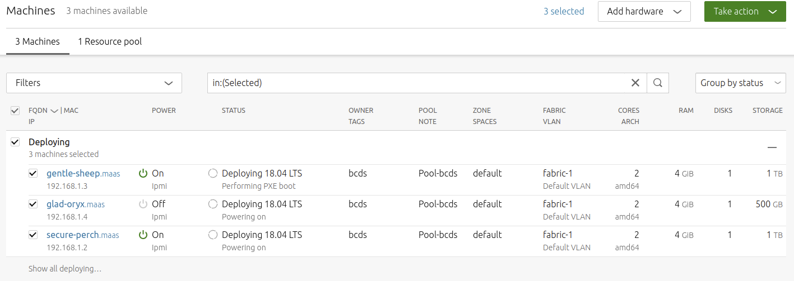{ width=350px }

En el nostre cas s'han creat dos servidors de virtualització anomenats eager-maggot i wanted-rabbit. 

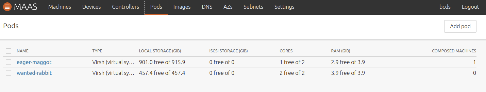{ width=500px }

Llavors, aquestes màquines que contenen Ubuntu amb un KVM server son màquines totalment manegades per maas? No. Les màquines que formen part del cluster ara son màquines indepentents que s'han instal·lat mitjançant maas peró son totalment accessibles i contenen un sistema operatiu complert. De fet per poder fer el login de les màquines MAAS ens permet afegir una clau pública al nostre usuari. Aquesta clau pública serà automàticament afegida com a clau d'autenticació del node i només qui contingui la clau privada podrà fer login. En el nostre cas, com que tenim un NAT hem generat un parell de claus des del node controlador i hem afegit la clau pública com a clau de l'usuari. 

D'aquesta manera quan aquest usuari faci el deploy sobre una màquina i instal·li un ubuntu podrà directament fer login amb la seva clau privada. Per connectar-nos a la màquina que s'acaba d'instal·lar doncs utiltizem la instrucció : 

```
ssh ubuntu@192.168.1.24 -i ~/.ssh/id_rsa
```

Per defecte, l'usuari que es crea com usuari de la màquina conté el nom de ubuntu. Amb aquest és amb el que podem iniciar sessió. Si hem marcat la casella que permet fer un servidor de virtualització quan hem fet el deploy també tindrem accés al servidor de virtualització mitjanḉant qemu+ssh. Per exemple la següent instrucció: 

```
$ virsh -c qemu+ssh://ubuntu@192.168.1.24/system list --all
 Id    Name                           State
----------------------------------------------------

```

En aquest moment veiem que no hi ha cap màquina virtual creada dins del servidor de virtualització. Per crear una màquina virtual, simplement cal entrar dins del pod i prèmer el botó take action -> compose. 

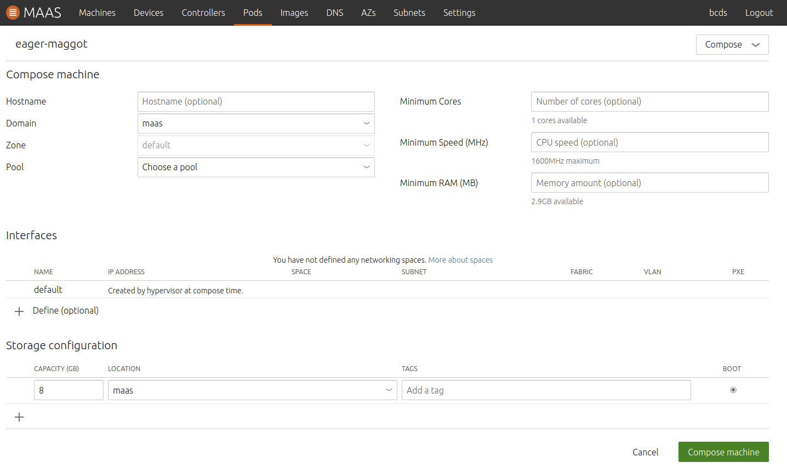{ width=500px }

El sistema virtual no ens permet crear una màquina virtual que tingui més hardware que la màquina host, peró sí que ens permet crear més d'una màquina amb menys hardware que sumant el global continguin més hardware que el host, és a dir, podria perfectament crear : 3 màquines de 1 core cada una. Aquesta acció es permet des de la configuració del POD. Se li aplica un multiplicador tal i com s'explica a [14]. Òbviament el que no podem és encendre-les totes a la vegada. 

En aquest cas s'ha creat una màquina virtual amb 1Gb de RAMM, 1 nucli i 20Gb de ramm. Un cop creada ens apareix a la llista de machines peró amb un tag diferent a les reals. 

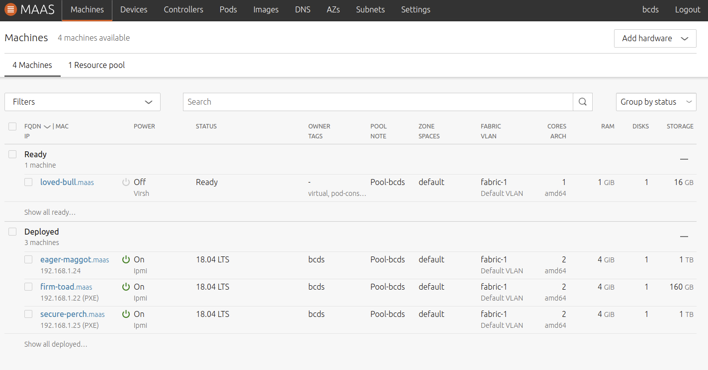{ width=500px }


# Referències 

- [1]  - [Dell poweredge 860](https://www.dell.com/downloads/emea/products/pedge/es/pe860_spec_sheet.pdf)
- [2]  - [BMC](https://docs.bmc.com/docs/bcm120/introducing-remote-management-570589616.html)
- [3]  - [IPMI](https://en.wikipedia.org/wiki/Intelligent_Platform_Management_Interface)
- [4]  - [MAAS](https://maas.io)
- [5]  - [MAAS Installation](https://maas.io/docs/install-from-packages)
- [6]  - [BMC - IMPMI 1.5](https://en.wikipedia.org/wiki/Intelligent_Platform_Management_Interface)
- [7]  - [Virish - QEMU](https://en.wikipedia.org/wiki/QEMU)
- [8]  - [Add Nodes](https://maas.io/docs/add-nodes)
- [9]  - [Intel finally releases its Rack Scale Design to Open Source](https://www.datacenterknowledge.com/archives/2016/07/29/intel-finally-releases-rack-scale-design-open-source)
- [10] - [Redfish wikipedia](https://en.wikipedia.org/wiki/Redfish_(specification))
- [11] - [Rack Scale Design: Composable Hardware][https://wiki.openstack.org/wiki/Valence#Rack_Scale_Design:_Composable_Hardware]
- [12] - [KVM Installation](https://help.ubuntu.com/community/KVM/Installation)
- [13] - [LibVirt -> tools -> virsh.pod](https://github.com/libvirt/libvirt/blob/master/tools/virsh.pod)
- [14] - [Overcommit resources](https://maas.io/docs/manage-composable-machines#heading--overcommit-resources)